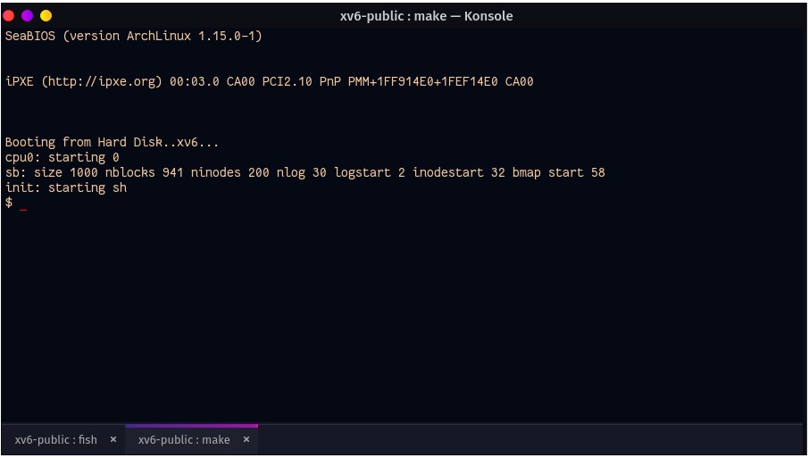
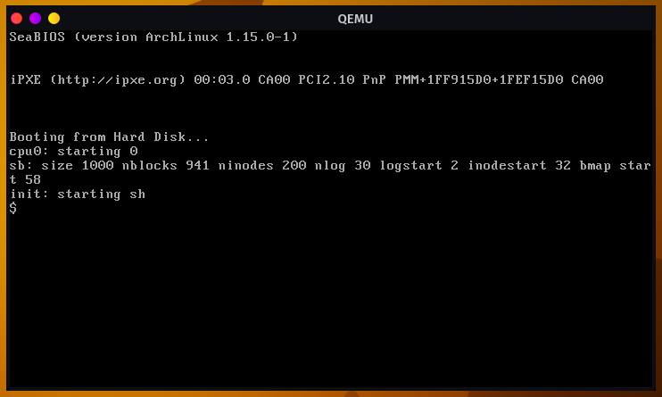

# xv6-rng70

---

This is modified version of official xv6-public version. As it was stated that "The main purpose of xv6 is as a teaching operating system for MIT's 6.S081, so we are more interested in simplifications and clarifications than new features" so no PR will be made through this fork.

# Installation 

---

This version is slightly modified and tested on

*   OS: Garuda Linux
*   Kernel: 5.15.12-zen1-1-zen
*   Shell: fish-3.3.1
*   gcc/g++: 11.1.0

***Case 1: make qemu "error: writing 1 byte into a region of size 0"***

​	two lines added before and after **line 1461: *lastaddr = 99; in usertests.c**

```c
#pragma GCC diagnostic ignored "-Wstringop-overflow"
*lastaddr = 99;
#pragma GCC diagnostic pop
```

***Case 2: qemu hangs on "Booting from hard disk..."***

​	this problem occurs specially on arch linux though it is quite common for other distros also. See PR[#155](https://github.com/mit-pdos/xv6-public/pull/155). to solve this problem Makefile was slightly modified.

*   ***Installation procedure***

    *   install qemu through pacman

        *   `sudo pacman -S qemu`

    *   clone this repository 

        *   `git clone https://github.com/rng70/xv6-public.git`

    *   go to the cloned repo and build and run

        *   cd xv6-public && make qemu

            **in arch linux `make qemu` work exactly `make qemu-nox` where xv6 run at the current terminal instead of new terminal (at least for fish shell). if it’s not then run `make qemu-nox` to run xv6 at the same terminal**

After successful build and run the terminal will look like this if `qemu-nox` works



otherwise a new qemu terminal will be opened



# Explore xv6 

---

*   [Modularize System Calls](https://github.com/rng70/easy-xv6#modularize-syscalls)  [file change](https://github.com/rng70/explore-xv6/tree/main/file-changed--modularize-syscall)
*   [Userlevel Indicator change](https://github.com/rng70/easy-xv6#modify-userlevel-indicator)  [file change](https://github.com/rng70/explore-xv6/tree/main/file-changed--userlevel-indicator)


## official statement [here](./README)
